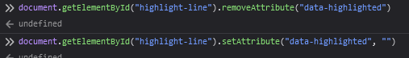

# Code highlighting
Boy was/is this a journey.
Below will be a list of the ressources that led me through the journey.

## Prism.js and Highlight.js
These are js libraries for beatiful syntax highlighting, and they are built for the browser.
Neither of these tools have support for URScript out of the box. This led to the next idea:

### Grammars
Grammars are the specifications of how to "understand" the syntax of a language (think, def in python or function in js).
Prism.js can be extended by supplying a grammar configuration
https://prismjs.com/extending.html
The problem with this however is that it seems like the prism configuration must be a js file, 
which makes it a tad more difficult to work with.

## TextMate
We know that there exists a VS Code extension that provides syntax highlighting, 
so the next idea could be to use their configuration file to supply the grammar. 
This file can be found here: 
[urscript textmate.json](https://github.com/ahernguo/urscript-extension/blob/master/syntaxes/urscript.tmLanguage.json).
VS Code uses a format called TextMate for their grammar. 
This format is relatively accepted, but for some reason neither Prism.js nor Highlight.js has support for loading grammars using TextMate. 
As documented in this rather long (but interesting) thread.
https://github.com/highlightjs/highlight.js/issues/2212

### Alternatives
[foo123](https://github.com/foo123) on GitHub has done some amazing work on trying to unify grammars for the online highlighting tools through his [editor-grammar](https://github.com/foo123/prism-grammar) family of tools of which i heavily considered [Prism-grammar](https://github.com/foo123/prism-grammar). The only downside is that he has created his own semi-proprietary grammar-format (because the world really need another).

All hope was not lost, since he might have been generous enough to create a converter, 
that could transpile textmate to his format, which could then be transpiled to the formats read by the highlighters:
`textmate -> foo -> all highlighters`. Alas, no luck 
["i will look into it if i have the time" - foo123 2022](https://github.com/foo123/editor-grammar/issues/9)

# starry-night
Here comes the (k)night in shining armor.
I discovered starry-night through 
[react-example.com](https://reactjsexample.com/syntax-highlighting-like-what-github-uses-to-highlight-code-but-free-and-open-source-and-javascript/#what-is-this) 
It was deeply buried in the google search results, but here we are. 
It is a slightly quirky website since it seems to be a straight rip-off of the 
[github readMe of starry-night](https://github.com/wooorm/starry-night), 
but they provide some link substitution to keep you on their site, an interesting corner of the web for sure.

### What about it?
Starry night has support for very many languages, but unfortunately not URScript. 
The reason for the wide support is probably that it is configured in the TextMate format (what a win).

This means that it _should_ be possible for us to relatively easily copy the textMate from ahernGuo and use it with starry-night to get syntax highlighting on our page.

The authors do say that starry-night is potentially slow, due to the grammars being _really good_ 
(not sure i understand the reasoning, but perhaps because the textmate grammars provided are very detailed).

### using starry-night
https://github.com/wooorm/starry-night/tree/main#example-using-starry-night-on-the-client

As a sanity check, this is the grammar for java in starry-night:
https://github.com/wooorm/starry-night/blob/main/lang/source.java.js

### using the textmate file provided
This is the important part.

>Idea 1
>https://github.com/wooorm/starry-night#compatibility
>It seems like i just need to provide `extensions:[.script]` and change `name:"..."` to `names:["..."]`
>
>By combining the knowledge from [Loading into browser](https://github.com/wooorm/starry-night/tree/main#use) where we can see that the starry night takes in a list of grammars [The list is exported here](https://github.com/wooorm/starry-night/blob/main/index.js). We can make a module that exports our own list of grammars. A list looks like this: [Common grammars](https://github.com/wooorm/starry-night/blob/main/lib/common.js).  And as discussed earlier a single grammar file looks like this: [grammar file for java](https://github.com/wooorm/starry-night/blob/main/lang/source.java.js)
>
>This all leads to the conclusion that _should_ be able to use starry-night for syntax highlighting of URScript, simply by converting the textmate.json file to a js file, and making sure that it works as an ES6 module. This should then be fed into the starry-night initialization factory, and we're off to the races.
>https://github.com/wooorm/starry-night#starrynightregistergrammars

>Idea 2 (if 1 does not work, 2 is very hard to grasp)
>Use the plugin https://github.com/wooorm/markdown-tm-language by modifying the languages variable.
>https://github.com/wooorm/markdown-tm-language/blob/main/build.js

## line highlighting using rehype
Line highlights can be done using:

