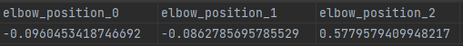

# Data news
This document describes some added information that might be useful for the data modeling.

## Safety limits
Possibly from the dashboard server through generate flight report: system (this is very slow, and the data provided is unknown. The flight report might just be saved as a file on the robot)

Or through primary interface: 3.1.8 [reference](https://s3-eu-west-1.amazonaws.com/ur-support-site/16496/ClientInterfaces_Primary.pdf) configuration data (this has the downside of having to be read from the primary interface which requires more work)
What we can get through the primary interface is:
- Joint min-max limits (rotation I think)
- Joint max speed
- Joint max acceleration

It does not seem possible to obtain:
- The guarding planes
- Max force per joint
- TCP max force

Through the RTDE we can however get
- Whether the robot is currently limited by safety limits or all is normal

## Standard digital and analog inputs
I told Miguel, that these were not possible to obtain. That turns out to be false.

standard_analog_output_0 and 1 is the only things that we cannot read from the RTDE using URs tool. 
Other external tools, seems to be capable of retrieving it, but I have not been successful in getting them to run.

Getting to read them from the primary interface is _probably_ possible, but requires a custom implementation, along with another headache of syncing this up with the fata received from the RTDE.
The EDDE is possibly a solution to this, that allows us to record this data as well.

Additional data, that was not previously known to be available:
```json
"elbow_position": "xyz, transmitted directly",
"variables":{
	"analog_input_0":double,
	"analog_input_1":double,
	"digital_outputs": bool (all outputs available),
	"digital_inputs": bool (all inputs available)
	"analog_output": not available (it should be, but the rtde logging tool fails with an error)
},
"safety config":{
	"is stopped due to safety reasons": "Safety status bits; Bits 0-10: Is normal mode | Is reduced mode | Is protective stopped | Is recovery mode | Is safeguard stopped | Is system emergency stopped | Is robot emergency stopped | Is emergency stopped | Is violation | Is fault | Is stopped due to safety"
}

```



## Internal variables without EDDE
It seems like the internal variables can be received from the primary interface, as long as they are declared global. 
Source: https://s3-eu-west-1.amazonaws.com/ur-support-site/16496/ClientInterfaces_Primary.pdf
Chapter 3.2.10 (see chapter 3 and 13 for information on parsing the data stream)

This will however be quite difficult, since we would have to write a listener for the primary interface, and the same troubles of syncing to the RTDE will arise. 
