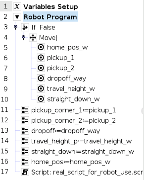

# How the robot communicates with python

We use the UR RTDE library to communicate with the robot from python.

We use input registers on the robot to send the x and y coordinates over. 

We use two output bit registers to communicate from the robot to the python application that the robot is ready.
The first (output 64) communicates by flipping its value (that is: both a change from 0 to 1 and a change from 1 to 0 is a ready signal).
This is supplemented by a pulsing signal on register 66 (output_bit_register 66) 
which pulses only while the robot is waiting for a camera input.

The python script communicates to the robot via input register 65 (input_bit_register 65). 
This also uses a change in value as a ready signal.

## Implementation
The .script file should be ready to use on the robot (apart from missing the correct method for gripper control).

The python file and the xml file should be used together as part fo UR rtde example package.

## Polyscope setup

### URCap installation
https://onrobot.com/en/downloads

Our compute box is version 5.9 so that is the one to select

https://onrobot.com/sites/default/files/documents/User_Manual_for_UR_v1.1.5_EN.pdf

The manual for the gripper, which also explains how to install and uninstall the URCap

