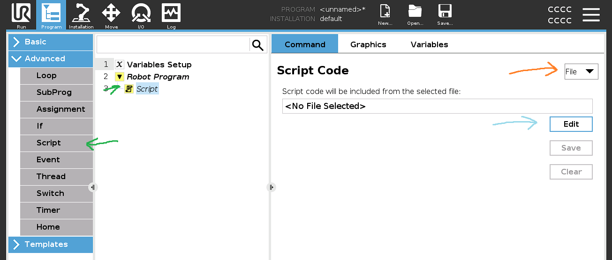
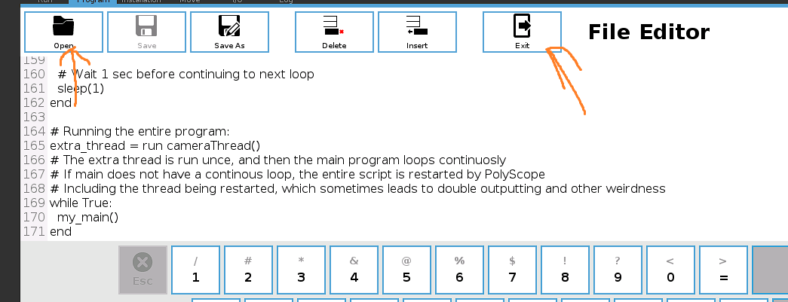

# Add it to the simulator
First you should add a script node (The green arrows), then Change it to use a file (Orange).
Then choose the file (Blue):
> 

In edit mode, after the file is opened, you should just exit.
> 
> 
> Making changes in this editor sometimes causes problems. 
> Although they may just be due to my weird configuration of docker in wsl.

